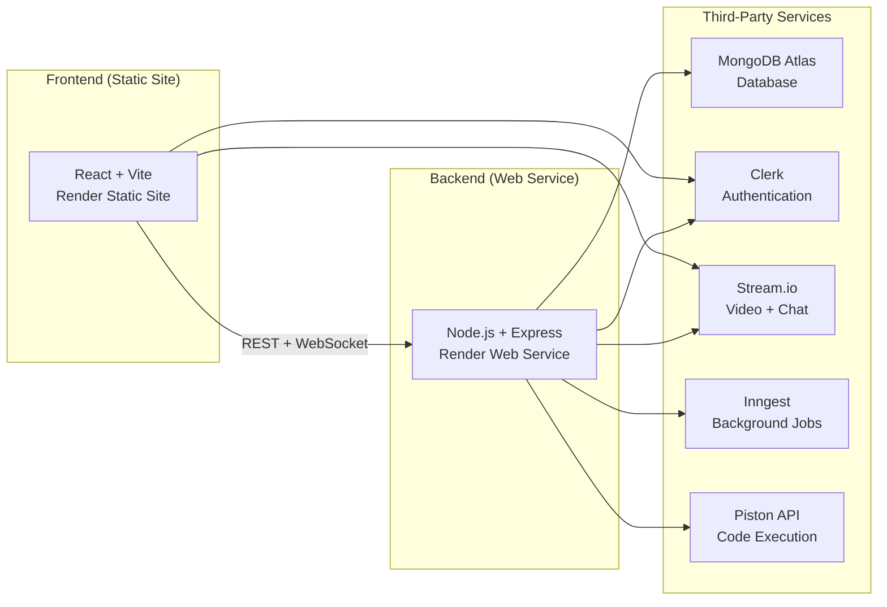

# 🚀 CodeZenith — End-to-End Deployment Guide

Deploy your CodeZenith technical interview platform so **anyone in the world** can join, code, video chat, and collaborate in real-time.

> [!IMPORTANT]
> Follow every step in order. Skipping a step will cause errors downstream. The entire process takes about 30–45 minutes.

---

## 📋 Architecture Overview



---

## Step 0 — Prerequisites

Before starting, ensure you have:

- [x] A **GitHub** account
- [x] A **MongoDB Atlas** account (free) — [https://www.mongodb.com/atlas](https://www.mongodb.com/atlas)
- [x] A **Clerk** account (free) — [https://clerk.com](https://clerk.com)
- [x] A **Stream** account (free) — [https://getstream.io](https://getstream.io)
- [x] An **Inngest** account (free) — [https://www.inngest.com](https://www.inngest.com)
- [x] A **Render** account (free) — [https://render.com](https://render.com)

> [!TIP]
> All services above have **free tiers** sufficient for this project.

---

## Step 1 — Push Code to GitHub

If not already on GitHub:

```bash
cd d:\study\CodeZenith-main
git init
git add .
git commit -m "Initial commit - CodeZenith deployment"
git branch -M main
git remote add origin https://github.com/YOUR_USERNAME/CodeZenith.git
git push -u origin main
```

> [!WARNING]
> Make sure your `.gitignore` includes `.env` and `node_modules`. Your `.gitignore` already has these — do **NOT** commit the `.env` files.

---

## Step 2 — MongoDB Atlas Setup

### 2.1 Create a Cluster

1. Go to [MongoDB Atlas](https://cloud.mongodb.com/) → **Create a New Cluster**
2. Select **M0 Free Tier** (Shared)
3. Choose a cloud provider & region close to your deployment (e.g., AWS `us-east-1`)
4. Click **Create Deployment**

### 2.2 Create a Database User

1. Go to **Database Access** → **Add New Database User**
2. Choose **Password** authentication
3. Set a username (e.g., `codezenith_admin`) and a **strong password**
4. Set privileges to **"Read and write to any database"**
5. Click **Add User**

### 2.3 Configure Network Access

1. Go to **Network Access** → **Add IP Address**
2. Click **"Allow Access from Anywhere"** (sets `0.0.0.0/0`)
   > This is required because Render uses dynamic IPs
3. Click **Confirm**

### 2.4 Get Your Connection String

1. Go to **Database** → Click **Connect** on your cluster
2. Choose **"Drivers"**
3. Copy the connection string. It looks like:
   ```
   mongodb+srv://codezenith_admin:<password>@cluster0.xxxxx.mongodb.net/CodeZenith?retryWrites=true&w=majority
   ```
4. Replace `<password>` with your actual password
5. Make sure the database name is `CodeZenith` (added after the `/` and before the `?`)

> [!IMPORTANT]
> Save this connection string — you'll use it as `DB_URL` in the backend environment variables.

---

## Step 3 — Clerk Authentication Setup

### 3.1 Create a Clerk Application

1. Go to [Clerk Dashboard](https://dashboard.clerk.com/) → **Create Application**
2. Name it `CodeZenith`
3. Choose your sign-in options (e.g., **Email**, **Google**, **GitHub**)
4. Click **Create Application**

### 3.2 Get API Keys

1. In your Clerk app, go to **API Keys**
2. Copy these two values:
   - **Publishable Key** → starts with `pk_test_` or `pk_live_`
   - **Secret Key** → starts with `sk_test_` or `sk_live_`

> [!IMPORTANT]
> Save both keys. The **Publishable Key** is used in both frontend AND backend. The **Secret Key** is backend-only.

### 3.3 Configure Clerk for Production

When you're ready for production:

1. In Clerk Dashboard → **Domains** → Add your production frontend URL (e.g., `https://codezenith.onrender.com`)
2. Switch to **Production** instance in Clerk (Clerk gives you separate prod keys with `pk_live_` and `sk_live_` prefixes)

### 3.4 Set Up Inngest Webhook in Clerk

Clerk sends events (like `user.created`, `user.deleted`) to Inngest via webhooks. This is configured in **Step 5** after you have the Inngest URL.

---

## Step 4 — Stream.io Setup (Video + Chat)

### 4.1 Create a Stream App

1. Go to [Stream Dashboard](https://dashboard.getstream.io/) → **Create App**
2. Name it `CodeZenith`
3. Select a server location (closest to your users)

### 4.2 Get API Credentials

1. In your app settings, find:
   - **API Key** (looks like `wqbar5f5np56`)
   - **API Secret** (long alphanumeric string)

> [!IMPORTANT]
> Save both. The **API Key** goes in both frontend (`VITE_STREAM_API_KEY`) and backend (`STREAM_API_KEY`). The **API Secret** is backend-only (`STREAM_API_SECRET`).

### 4.3 Enable Video Calling

1. In Stream Dashboard → Your app → **Video & Audio**
2. Make sure **Video Calling** is enabled

---

## Step 5 — Inngest Setup (Background Jobs)

Inngest handles async events like auto-creating/deleting users in your DB when Clerk auth events fire.

### 5.1 Create an Inngest Account

1. Go to [Inngest Dashboard](https://app.inngest.com/) → Sign up / Sign in

### 5.2 Get API Keys

1. Go to **Settings** → **Keys**
2. Find or create:
   - **Event Key** — used to send events
   - **Signing Key** — used to verify webhooks

> [!IMPORTANT]
> Save both keys as `INNGEST_EVENT_KEY` and `INNGEST_SIGNING_KEY`.

### 5.3 Connect Clerk Webhooks → Inngest (Done After Backend Deploys)

This step is completed in **Step 8** after deployment, because you need the live backend URL first.

---

## Step 6 — Deploy Backend on Render

### 6.1 Create a Web Service

1. Go to [Render Dashboard](https://dashboard.render.com/) → **New** → **Web Service**
2. Connect your **GitHub repo** (`CodeZenith`)
3. Configure:

| Setting | Value |
|---|---|
| **Name** | `codezenith-backend` |
| **Region** | Choose closest to your MongoDB Atlas cluster |
| **Branch** | `main` |
| **Root Directory** | `backend` |
| **Runtime** | `Node` |
| **Build Command** | `npm install` |
| **Start Command** | `node src/server.js` |
| **Instance Type** | `Free` |

### 6.2 Set Environment Variables

In Render → Your web service → **Environment** → Add the following:

| Variable | Value |
|---|---|
| `PORT` | `10000` |
| `NODE_ENV` | `production` |
| `DB_URL` | Your MongoDB Atlas connection string from Step 2.4 |
| `CLERK_PUBLISHABLE_KEY` | Your Clerk publishable key from Step 3.2 |
| `CLERK_SECRET_KEY` | Your Clerk secret key from Step 3.2 |
| `STREAM_API_KEY` | Your Stream API key from Step 4.2 |
| `STREAM_API_SECRET` | Your Stream API secret from Step 4.2 |
| `INNGEST_EVENT_KEY` | Your Inngest event key from Step 5.2 |
| `INNGEST_SIGNING_KEY` | Your Inngest signing key from Step 5.2 |
| `CLIENT_URL` | `https://codezenith-frontend.onrender.com` *(your frontend URL — set this after creating the frontend service in Step 7)* |
| `CODE_EXECUTION_PROVIDER` | `piston` |
| `ALLOW_LOCAL_CODE_EXECUTION` | `false` |

> [!WARNING]
> **`PORT` must be `10000`** — Render assigns port 10000 by default. Do NOT use 3000.
>
> **`CODE_EXECUTION_PROVIDER` must be `piston`** — Local code execution (`child_process`) is dangerous on shared hosting and won't have compilers installed. Piston API (https://emkc.org) is a free, public sandboxed execution service.
>
> **`ALLOW_LOCAL_CODE_EXECUTION` must be `false`** — This prevents the fallback to local execution on production.

### 6.3 Deploy

Click **Create Web Service**. Render will:
1. Clone your repo
2. Run `npm install` in the `backend/` directory
3. Start `node src/server.js`

Wait for the deploy to succeed. Note your backend URL:
```
https://codezenith-backend.onrender.com
```

> [!NOTE]
> Render free tier services spin down after 15 minutes of inactivity. The first request after sleep takes ~30 seconds. This is normal for free tier.

---

## Step 7 — Deploy Frontend on Render

### 7.1 Create a Static Site

1. Go to [Render Dashboard](https://dashboard.render.com/) → **New** → **Static Site**
2. Connect the same **GitHub repo**
3. Configure:

| Setting | Value |
|---|---|
| **Name** | `codezenith-frontend` |
| **Branch** | `main` |
| **Root Directory** | `frontend` |
| **Build Command** | `npm install && npm run build` |
| **Publish Directory** | `dist` |

### 7.2 Set Environment Variables

| Variable | Value |
|---|---|
| `VITE_CLERK_PUBLISHABLE_KEY` | Your Clerk publishable key (same as backend) |
| `VITE_API_URL` | `https://codezenith-backend.onrender.com/api` |
| `VITE_STREAM_API_KEY` | Your Stream API key (same as backend) |

> [!IMPORTANT]
> `VITE_` prefix is required — Vite only exposes env vars starting with `VITE_` to the frontend bundle.

### 7.3 Add Rewrite Rules for SPA Routing

Since this is a single-page React app with client-side routing, you need to add a rewrite rule:

1. In Render → Your static site → **Redirects/Rewrites**
2. Add a rewrite rule:

| Source | Destination | Type |
|---|---|---|
| `/*` | `/index.html` | `Rewrite` |

> [!CAUTION]
> Without this rewrite rule, direct URL access to routes like `/dashboard`, `/session/123` etc. will return 404 errors.

### 7.4 Deploy

Click **Create Static Site**. Render will build your Vite app and serve the `dist/` folder.

Your frontend URL:
```
https://codezenith-frontend.onrender.com
```

---

## 🔀 Alternative: Single-Service Deployment (Simpler)

Your project already supports a **monolithic deployment** where the backend serves the frontend. This is simpler (1 service instead of 2) and avoids CORS entirely.

### How It Works

Your root `package.json` has:
```json
{
  "build": "npm install --prefix backend && npm install --prefix frontend && npm run build --prefix frontend",
  "start": "npm run start --prefix backend"
}
```

And your `server.js` already serves the frontend in production:
```javascript
if (ENV.NODE_ENV === "production") {
  app.use(express.static(path.join(__dirname, "../frontend/dist")));
  app.get("/{*any}", (req, res) => {
    res.sendFile(path.join(__dirname, "../frontend", "dist", "index.html"));
  });
}
```

### Single-Service Setup on Render

| Setting | Value |
|---|---|
| **Root Directory** | *(leave empty — use repo root)* |
| **Build Command** | `npm run build` |
| **Start Command** | `npm run start` |

### Environment Variables (Single-Service)

Same as the backend env vars from Step 6.2, **plus**:

| Variable | Value |
|---|---|
| `CLIENT_URL` | `https://codezenith.onrender.com` *(same domain since it's one service)* |
| `VITE_API_URL` | `/api` *(relative path — same origin, no CORS needed)* |
| `VITE_CLERK_PUBLISHABLE_KEY` | Your Clerk publishable key |
| `VITE_STREAM_API_KEY` | Your Stream API key |

> [!TIP]
> **Pros**: Simpler, no CORS issues, 1 free service instead of 2, WebSocket on same origin.
> **Cons**: Slightly longer cold-start on Render free tier (builds both frontend & backend).
>
> **If you choose this approach, skip Step 7 entirely and set `CLIENT_URL` to the service's own URL.**

---

## Step 8 — Post-Deployment Configuration

### 8.1 Update Backend `CLIENT_URL`

Now that you know your exact frontend URL:

1. Go to Render → `codezenith-backend` → **Environment**
2. Set `CLIENT_URL` to your exact frontend URL:
   ```
   https://codezenith-frontend.onrender.com
   ```
3. Click **Save Changes** — this triggers a re-deploy

### 8.2 Configure Clerk Webhooks → Inngest

Your backend exposes an Inngest endpoint at:
```
https://codezenith-backend.onrender.com/api/inngest
```

#### Set up Clerk → Inngest:

1. Go to [Clerk Dashboard](https://dashboard.clerk.com/) → Your app → **Webhooks**
2. Click **Add Endpoint**
3. Set the **Endpoint URL** to your Inngest webhook URL. 
   
   > To get this URL: Go to [Inngest Dashboard](https://app.inngest.com/) → **Manage** → **Webhooks** → Copy the webhook URL for Clerk events. It looks like: `https://inn.gs/e/YOUR_EVENT_KEY`
   
4. Select events: `user.created`, `user.deleted`
5. Click **Create**

#### Register your app with Inngest:

1. Go to [Inngest Dashboard](https://app.inngest.com/) → **Apps**
2. Click **Sync New App**
3. Enter your backend's Inngest serve URL:
   ```
   https://codezenith-backend.onrender.com/api/inngest
   ```
4. Click **Sync** — Inngest will discover your two functions (`sync-user`, `delete-user-from-db`)

### 8.3 Update Clerk Allowed Origins

1. Go to Clerk Dashboard → **Domains**
2. Add your production frontend URL: `https://codezenith-frontend.onrender.com`
3. This ensures Clerk auth works on your deployed frontend

### 8.4 Update Stream.io Allowed Origins (Optional)

1. Go to Stream Dashboard → Your app → **Settings**
2. Add your frontend URL to allowed origins if required

---

## Step 9 — Required Code Changes for Production

Before deploying, make these small changes to ensure production compatibility:

### 9.1 Fix `dotenv` Path Resolution

The `dotenv.config()` call in `server.js` needs no path argument because Render sets env vars directly in the environment — `dotenv` simply reads `process.env`. No change needed here since Render injects env vars.

### 9.2 Verify CORS & Socket.IO Configuration

Your backend already handles this correctly:
- CORS allows `CLIENT_URL` + localhost origins (filtered with `.filter(Boolean)`)
- Socket.IO uses the same `allowedOrigins` array
- ✅ No changes needed

### 9.3 Production Static File Serving

Your `server.js` already serves the frontend in production mode:

```javascript
if (ENV.NODE_ENV === "production") {
  app.use(express.static(path.join(__dirname, "../frontend/dist")));
  app.get("/{*any}", (req, res) => {
    res.sendFile(path.join(__dirname, "../frontend", "dist", "index.html"));
  });
}
```

> [!NOTE]
> This code serves the frontend from the backend in a **monolithic deployment** scenario. Since we're deploying frontend and backend separately on Render, this code won't activate (frontend is on its own static site). It's harmless to leave it.

---

## Step 10 — Verification Checklist

After deployment, verify each feature:

> [!NOTE]
> **Problems auto-seed!** The first time you visit the Problems page or load a question, the app checks if the `questions` collection is empty and automatically seeds it with 5 built-in problems (Two Sum, Reverse String, Valid Palindrome, Maximum Subarray, Container With Most Water). No manual data import needed.

### 10.1 Basic Health Check
```bash
curl https://codezenith-backend.onrender.com/health
```
Expected: `{"msg":"api is up and running"}`

### 10.2 Authentication Flow
1. Open `https://codezenith-frontend.onrender.com`
2. Sign up / Sign in via Clerk
3. Verify you're redirected to `/dashboard`

### 10.3 User Sync (Inngest)
1. After signing up, check MongoDB Atlas → `CodeZenith` database → `users` collection
2. Verify a user document was created with your Clerk ID

### 10.4 Create an Interview Session
1. From the dashboard, create a new session
2. Share the join link with another user
3. Both users should see each other in the session

### 10.5 Video & Audio
1. In a session, enable camera/mic
2. Verify video/audio works between both participants

### 10.6 Real-Time Code Collaboration
1. In a session, type code in the editor
2. Verify the other participant sees code changes in real-time (via Socket.IO)

### 10.7 Code Execution
1. Write a simple solution in the editor
2. Click "Run" — verify output appears
3. Click "Submit" — verify test case results

> [!NOTE]
> **Two code execution paths exist:**
> - **In a session** → Code goes through your backend (`POST /api/code/execute`) → Piston API. The backend wraps the code in a test harness with visible/hidden test cases.
> - **Solo practice (Problems page)** → Code runs **directly from the browser** to the Piston API (`https://emkc.org/api/v2/piston`). No backend involved.

### 10.8 Chat
1. In a session, send a chat message
2. Verify the other participant receives it

---

## 🔧 Troubleshooting

### Problem: Backend fails to start on Render
**Cause**: Missing environment variables.
**Fix**: Double-check ALL env vars in Render → Environment. Common miss: `DB_URL`, `CLERK_SECRET_KEY`.

### Problem: `CORS error` in browser console
**Cause**: `CLIENT_URL` doesn't match your frontend domain.
**Fix**: Update `CLIENT_URL` in backend env to exact frontend URL (no trailing slash).

### Problem: WebSocket/Socket.IO not connecting
**Cause**: The Socket.IO URL is derived from `VITE_API_URL` in the frontend. 
**Fix**: Ensure `VITE_API_URL` points to `https://codezenith-backend.onrender.com/api`. The Socket.IO client extracts the origin (`https://codezenith-backend.onrender.com`) automatically.

### Problem: Clerk auth not working on deployed site
**Cause**: Clerk domain not configured for production URL.
**Fix**: Add your frontend URL to Clerk Dashboard → Domains.

### Problem: Code execution fails with "Execution provider failed"
**Cause**: Piston API might be temporarily down or rate-limited.
**Fix**: The Piston API at `https://emkc.org/api/v2/piston` is public and free — if it's down, wait and retry. For reliability, consider self-hosting Piston.

### Problem: Users not being created in DB on sign-up
**Cause**: Inngest webhook not configured or not synced.
**Fix**: 
1. Check Inngest dashboard for failed events
2. Re-sync your app at `https://codezenith-backend.onrender.com/api/inngest`
3. Note: The `protectRoute` middleware also auto-creates users on first API call, so this is a fallback.

### Problem: Render free tier is slow (30s cold start)
**Cause**: Free tier spins down after 15 min of inactivity.
**Fix**: 
- Use a free cron service like [UptimeRobot](https://uptimerobot.com/) to ping `https://codezenith-backend.onrender.com/health` every 14 minutes
- Or upgrade to Render's paid plan ($7/mo)

### Problem: `secretOrPrivateKey is not valid key material`
**Cause**: The Stream client was initialized incorrectly.
**Fix**: This was already fixed — the `stream.js` file now passes the raw API secret string directly to `StreamClient`.

---

## 📊 Environment Variables Summary

### Backend (`backend/.env` on Render)

| Variable | Example | Notes |
|---|---|---|
| `PORT` | `10000` | Render default |
| `NODE_ENV` | `production` | Enables production mode |
| `DB_URL` | `mongodb+srv://...` | MongoDB Atlas connection string |
| `CLERK_PUBLISHABLE_KEY` | `pk_live_...` | Same key as frontend |
| `CLERK_SECRET_KEY` | `sk_live_...` | Backend only |
| `STREAM_API_KEY` | `wqbar5f5np56` | Same key as frontend |
| `STREAM_API_SECRET` | `yyefck...` | Backend only |
| `INNGEST_EVENT_KEY` | `...` | From Inngest dashboard |
| `INNGEST_SIGNING_KEY` | `...` | From Inngest dashboard |
| `CLIENT_URL` | `https://codezenith-frontend.onrender.com` | Your frontend URL |
| `CODE_EXECUTION_PROVIDER` | `piston` | Use `piston` for production |
| `ALLOW_LOCAL_CODE_EXECUTION` | `false` | Disable local exec in production |

### Frontend (Render Static Site Environment)

| Variable | Example | Notes |
|---|---|---|
| `VITE_CLERK_PUBLISHABLE_KEY` | `pk_live_...` | Same as backend's `CLERK_PUBLISHABLE_KEY` |
| `VITE_API_URL` | `https://codezenith-backend.onrender.com/api` | Full API URL with `/api` suffix |
| `VITE_STREAM_API_KEY` | `wqbar5f5np56` | Same as backend's `STREAM_API_KEY` |

---

## 🎉 You're Done!

Your CodeZenith platform is now live at:
- **Frontend**: `https://codezenith-frontend.onrender.com`
- **Backend**: `https://codezenith-backend.onrender.com`

Anyone in the world can now:
- ✅ Sign up and sign in
- ✅ Create and join interview sessions
- ✅ Share audio, video, and screen
- ✅ Collaborate on code in real-time
- ✅ Execute code in JavaScript, Python, Java, and C++
- ✅ Chat with other participants
- ✅ Practice coding problems solo
